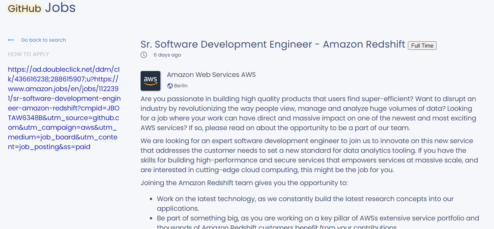
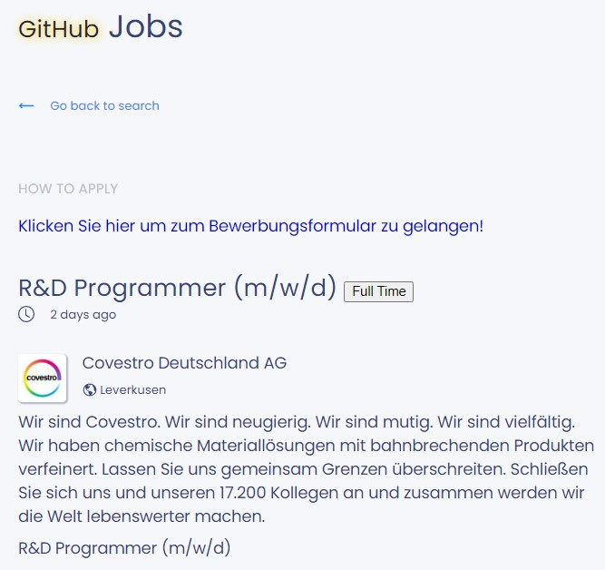
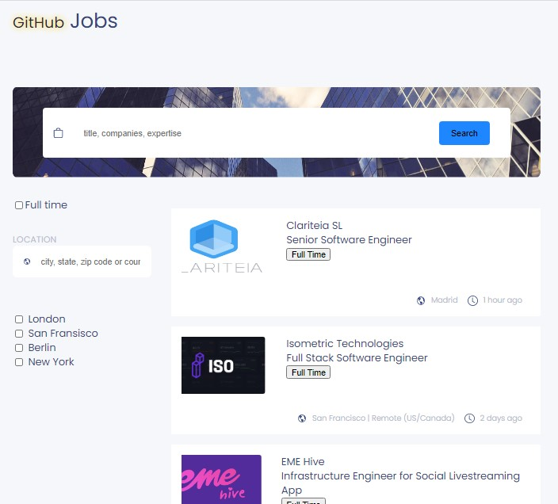
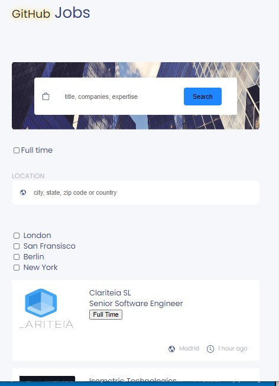

# Github Jobs

Here we are, the last graded project of this semester.

My challenge: Create a job search using an API, and use React to handle the frontend. 

<!-- Please update value in the {}  -->

<h1 align="center">Github Jobs</h1>

<div align="center">
  <h3>
    <a href="https://github-jobs-tanteli.netlify.app/">
      Demo
    </a>
    <span> | </span>
    <a href="https://github.com/starjardin/github-jobs">
      Solution
    </a>
  </h3>
</div>

<!-- TABLE OF CONTENTS -->

## Table of Contents

-   [Overview](#overview)
    -   [Built With](#built-with)
-   [Features](#features)
-   [How to use](#how-to-use)
-   [Contact](#contact)
-   [Acknowledgements](#acknowledgements)

<!-- OVERVIEW -->

## Overview

Introduce your projects by taking a screenshot or a gif. Try to tell visitors a story about your project by answering:






-   You can see the demo of this app by clicking this following link <a href="https://github-jobs-tanteli.netlify.app/">Demo</a>
-   In this project, I can say tones of things but I will make long story short. First, it was very challenging and enjoyable, at least for me. The most challenging part was to get used to the dispatch and reducer fuctions. There were lots of discoveries during the project such as I learned using axios, which I knew a little before and now I know more than I did. This part, the job description, in which we get a html string from json is also a fun one, there I had to do lots of researches to get it work in normal html.
-   In a few sentences, I am going to explain breifly about my project. To start with, the project was not perfectly done, however, some of the features are working fine. One thing that I am not really satified and I am really sad about is that I did not get the loading state while the data fetching is still busy, however some of them are working such as in the page first load, the loading state is showing but when you start searching, the laoding state does not show.
-   If I had more time, I would definitely improve my this project. First thing I would start thinking about is the loading state because I am not happy with it. Secondly, I would start making some of the styles a bit better. And finally, I would give it a try with the optional part which are the paginations and the job searching depending on the nearest city where you are. I haven't done it nor have I given it a try but I think with in a lot of research, it would be doable.
-   I would lie if I said I didn't learn anything in this project, absolutely I learned tones of things. First of all, it was a best practice for using reducer and context together. More than that, I tried using libraries that are I am not familiar with but in the end they work just fine. Using styled components are now becoming more in the hands which I think is a new thing to know.
-   The most challenging part of the project was modifying the url depending on what you are searching for. A big one that I could not solved was the loading state which is very very important for the user and it would make your app shines as well.
-   One thing that I have noticed during thing project was my work speed. I think I need to work more my speed as well. Finally, Planning before diving into the project is very crucial but I think I am still in the process of getting there.


### Built With

<!-- This section should list any major frameworks that you built your project using. Here are a few examples.-->

-   [React](https://reactjs.org/)

## Features

<!-- List the features of your application or follow the template. Don't share the figma file here :) -->

## How To Use

<!-- Example: -->

To clone and run this application, you'll need [Git](https://git-scm.com) and [Node.js](https://nodejs.org/en/download/) (which comes with [npm](http://npmjs.com)) installed on your computer. From your command line:

```bash
# Clone this repository
$ git clone https://github.com/your-user-name/your-project-name

# Install dependencies
$ npm install

# Run the app
$ npm start
```

## Acknowledgements

<!-- This section should list any articles or add-ons/plugins that helps you to complete the project. This is optional but it will help you in the future. For example: -->

## Contact

-   Website [your-website.com](https://{your-web-site-link})
-   GitHub [starjardin](https://github.com/starjardin)
